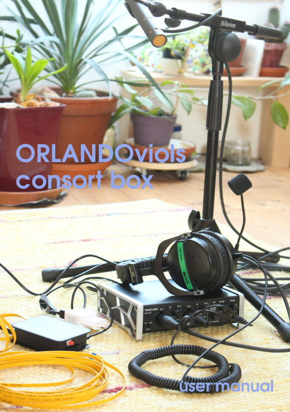

# ORLANDOviols Consort box (ovbox)

The ovbox is a remote collaboration box developed by the ensemble
[ORLANDOviols](http://orlandoviols.com) primarily to allow rehearsals
during the lockdown due to Covid19 pandemia. This box is completely
built upon open source software and open or standardized hardware.



## Installation instructions

For installation instructions see file [INSTALL.md](INSTALL.md).

Once your installation is ready you may wish to get an account at box.orlandoviols.com - in that case please contact us via e-mail.

## User manual

A user manual for the complete system can be found on the [wiki](https://github.com/gisogrimm/ovbox/wiki).

## Tested hardware components

Here are the shopping lists we use - obviously these can be obtained from any electronics/music store:

[Raspberry Pi etc.](https://www.reichelt.de/my/1693204) (approx. 67 EUR)

[Sound card, mic, etc.](https://www.thomann.de/de/wishlist_4u_788b06e69103.html) (approx. 185 EUR)


Raspberry Pi 4B (recommended), Raspberry Pi 3B+, Linux PC with current
Ubuntu LTS (20.04, 18.04, 16.04)

Scarlett Solo (recommended), TASCAM US2x2, Mackie Onyx 2-2, or any
other class compliant USB sound card

basic condenser mic, headphones, cables

optionally: a small head tracking device based on MPU6050+ESP8266

## Software components

Raspbian Linux operating system
[https://www.raspberrypi.org/downloads/raspbian/](https://www.raspberrypi.org/downloads/raspbian/)

jack audio connection kit (audio server)
[https://jackaudio.org/](https://jackaudio.org/)

zita-njbridge (network audio/adaptive resampler)
[https://kokkinizita.linuxaudio.org/linuxaudio/](https://kokkinizita.linuxaudio.org/linuxaudio/)

TASCAR (virtual acoustic engine)
[http://tascar.org/](http://tascar.org/)

a self-written UDP tunnel and multiplexer (see folder udpmirror)

## Performance

We use this box since April 15th 2020, almost every day. The software
is optimized continouosly. With the current settings we achieve delays
between musicians ranging from 40ms (optical fiber network/DSL) and
67ms (connection via mobile network), with a tolerable amount of
dropouts. This delay contains the network transmission time, the
jitter buffer (currently 14ms), and the delay of the audio hardware
(currently 11ms). We connect 4-5 devices.

The device sends 16bit audio at 48 kHz sampling rate. The signal is
rendered to headphones using virtual 3D audio. Streaming to platforms
such as youtube is possible using a session on a PC, with OBS studio
and other pro-audio software.

## Architecture

On a central server (or one endpoint reachable from outside) the
multiplexer/tunnel server `roomservice` needs to be running. This
listens at a single UDP port. On the configuration/management server,
a web based user interface is running. This server also runs a small
database system, which stores device configurations and room settings.
The boxes connect to this server, receive a configuration file, and
start multiplexer client software `ovboxclient` to connect with the
`roomservice` chosen in the web user interface. Now the boxes can
receive UDP messages from the other participants sent to their client
software. UDP messages sent to the local client are transferred to the
`roomservice`. To minimize data manipulation, the packages are
protected by a 32bit secret (but not encrypted).

At each endpoint, one intance of zita-n2j is started for each
potential participant. One instance of zita-j2n is started on each box
to stream the local audio to the other participants. The session
management and audio mixing is performed in TASCAR.

The underlying adaptive resampling of zita-njbridge is described in
[https://kokkinizita.linuxaudio.org/papers/adapt-resamp.pdf](https://kokkinizita.linuxaudio.org/papers/adapt-resamp.pdf).

A simple mixing interface is provided with `node-js` and some TASCAR
extensions. This mixer interface can be opened from any
html5-compatible browser in the same network as the ovbox, and is
optimized for smartphone/touch use.

For a description of our "House of Consort" (a virtual building with
lots of rooms to play music), see [vision.md](doc/vision.md) (this is
not a vision anymore). If you would like to get access to our "House
of Consort", please contact us via email.


## Starting the tools

On our boxes, TASCAR is not only used for virtual acoustic simulation,
but also for the whole session management. Essentially, on each client
these commands are started:

````
jackd --sync -P 40 -d alsa -d hw:1 -r 48000 -p 96 -n 2
````

This starts the audio backend. `--sync` is required for delay
optimization, since jackd2 uses one extra block in multi-threading
mode. `-P 40` sets realtime priority - this can be adjusted,
especially on realtime patched kernels, to the system requirements and
potential rtirq settings. `-d alsa` selects ALSA driver. `-d hw:US2x2`
is the TASCAM US2x2 audio device. `-r 48000` is the sampling
rate. Again, for delay optimization it is advisable to use a period
size which is a multiple of 1 ms, since USB audio protocol transmits
1ms chunks. To allow this, a sampling rate of 48000 Hz is preferred
over 44100 Hz. `-p 96` sets the fragment size to 2 ms. `-n 2` sets to
use two buffers (which is the default anyway).

If you are using jackd2 with dbus enabled, but your system is running
as a headless system, you should deactivate audio card reservation by
setting the environment variable `JACK_NO_AUDIO_RESERVATION=1`:

````
JACK_NO_AUDIO_RESERVATION=1 jackd --sync -P 40 -d alsa -d hw:US2x2 -r 48000 -p 96 -n 2
````

Alternatively you may compile your own jackd with dbus deactivated.


In folder `cfg`, start the session management tool:
````
cd cfg
../udpmirror/devconfigclient
````

This starts the multiplexer/tunnel client. It will connect with our
session management service at http://box.orlandoviols.com/ (this can
be changed with the `-l` flag).

Upon session registration, this will start a TASCAR session, with
something like these network clients (details will depend on your
configuration):

````
../udpmirror/ovboxclient -s 8367365 -d 123.23.12.45 -p 4367 -c 0 -l 4464 -2
zita-n2j --chan 1 --jname Marthe --buff 15 0.0.0.0 4466
zita-n2j --chan 1 --jname Frauke --buff 17 0.0.0.0 4468
zita-n2j --chan 1 --jname Hille --buff 19 0.0.0.0 4470
zita-n2j --chan 1 --jname Claas --buff 14 0.0.0.0 4472
````

These are the real audio clients. The `ovboxclient` will distribute
UDP messages from the server to these clients. The output of these
clients can then used in jack for mixing (in our case spatialization
with TASCAR, but any other panning/mixing could be possible). The
jitter buffer is adjusted manually to the individual network quality -
this should be replaced by a better interface in the future.

````
zita-j2n --chan 1 --jname sender --16bit 127.0.0.1 4464
````

This is the tool which sends the local microphone signal to the local
UDP port of `mplx_client`, which will forward it to the server (or
other clients).

In addition, some jack ports need to be connected:

````
jack_connect Marthe:out_1 render.scene:Marthe.0.0
jack_connect Frauke:out_1 render.scene:Frauke.0.0
jack_connect Hille:out_1 render.scene:Hille.0.0
jack_connect Claas:out_1 render.scene:Claas.0.0
jack_connect system:capture_1 sender:in_1
````
Here, `render.scene` is the TASCAR scene, which could be replaced by
another mixer or simply by using the hardware outputs directly. The
last line connects the first hardware input channel with the sender.

## udp tunnel tools

The tools `roomservice` and `ovboxclient` form the main communication
protocol. They are essentially a STUN server and a TURN server, and
provide a minimalistic session management.

## peer-to-peer mode vs server mode

The `roomservice` / `ovboxclient` tools support connection via server
or a peer-to-peer mode. In both cases the central server is needed for
negotiation of the participants. peer-to-peer mode can activated at
the client with the `-2` flag. A mixed automatic switching between
peer-to-peer mode and server mode based on the client behavior and
statistics is currently under development.

## hardware delay

We run the sound system with 48000 Hz sampling rate and periods of 2
ms (96 samples). The measured hardware delay (combined input and
output), as caused by block processing, USB BUS protocol and aliasing
filters is:

|                  | period size | delay       | delay   |
|------------------|-------------|-------------|---------|
|                  |             |             |         |
| TASCAM US-2x2    | 96          | 518 samples | 10.8 ms |
|                  | 48          | 316 samples |  6.7 ms |
| TASCAM US-100    | 96          | 510 samples | 10.6 ms |
|                  |             |             |         |
| ConnectAUDIO 2/4 | 96          | 652 samples | 13.6 ms |
|                  | 48          | 620 samples | 13.0 ms |
|                  | 144         | 844 samples | 17.6 ms |
|                  |             |             |         |
| Scarlett Solo    | 96          | 429 samples |  8.9 ms |
|                  | 48          | 233 samples |  4.9 ms |
| Mackie Onyx 2-2  | 96          | 587 samples | 12.2 ms |
|                  | 48          | 364 samples |  7.6 ms |

