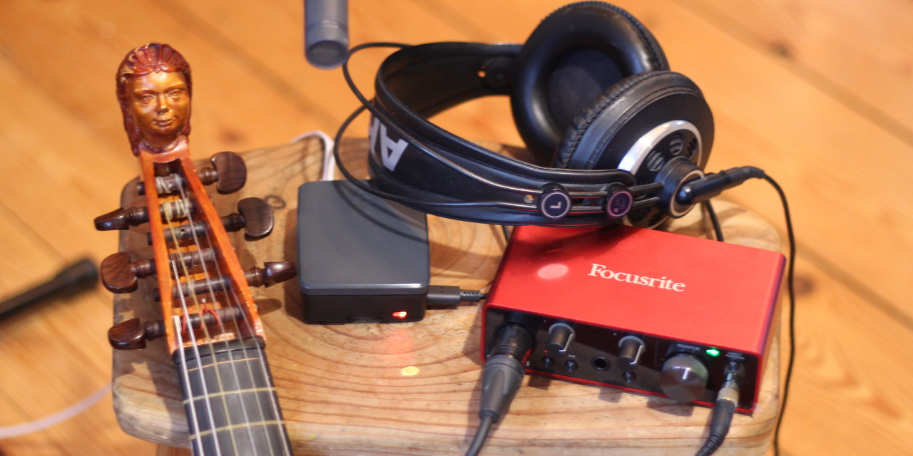

# ORLANDOviols Consort box (ovbox)

The ovbox is a remote collaboration box developed by the ensemble
[ORLANDOviols](http://orlandoviols.com) primarily to allow rehearsals
during the lockdown due to Covid19 pandemia. This box is completely
built upon open source software and open or standardized hardware.

We are contributing to the [digital stage](https://digital-stage.org/)
project. It is our aim to achieve full compatibility of the ovbox with
the digital stage system. See also the
(ov-client)[https://github.com/gisogrimm/ov-client), which is the base
of the digital stage and ORLANDOviols audio render client.

## Installation instructions

For installation instructions see file [INSTALL.md](INSTALL.md).

Once your installation is ready you may create an account at box.orlandoviols.com.

## User manual

A user manual for the complete system can be found on the [wiki](https://github.com/gisogrimm/ovbox/wiki).

## Tested hardware components

Here are the shopping lists we use - obviously these can be obtained
from any electronics/music store. These are just recommendation, other
hardware may also work or perform even better:

**Raspberry Pi etc.:** [Reichelt](https://www.reichelt.de/my/1693204) (approx. 67 EUR)

Or from berrybase:
[microSD card](https://www.berrybase.de/raspberry-pi-co/raspberry-pi/speicherkarten/sandisk-ultra-microsdhc-a1-98mb/s-class-10-speicherkarte-43-adapter-32gb),
[network cable](https://www.berrybase.de/netzwerk/patchkabel-netzwerkkabel/cat-patchkabel/bestellartikel/cat-6-netzwerkkabel-f/utp-flach-wei-223),
[power adapter](https://www.berrybase.de/raspberry-pi-co/raspberry-pi/stromversorgung/netzteile-fuer-die-steckdose/offizielles-raspberry-pi-usb-c-netzteil-5-1v/3-0a-eu-schwarz),
[case](https://www.berrybase.de/raspberry-pi-co/raspberry-pi/raspberry-swag/offizielles-geh-228-use-f-252-r-raspberry-pi-4-schwarz/grau) and
[Raspberry Pi 4B](https://www.berrybase.de/raspberry-pi-co/raspberry-pi/boards/raspberry-pi-4-computer-modell-b-2gb-ram)

**Sound card, mic, etc.:** [Thomann](https://www.thomann.de/de/wishlist_4u_788b06e69103.html) (approx. 209 EUR)

Raspberry Pi 4B (recommended), Raspberry Pi 3B+, Linux PC with current
Ubuntu LTS (20.04, 18.04, 16.04)

Scarlett Solo (recommended), TASCAM US2x2, Mackie Onyx 2-2, or any
other class compliant USB sound card. We also tested the low-cost USB microphone 'Superlux E205U', which works, however, on the Raspberry it produces a clearly audible tonal noise due to low quality USB power.

basic condenser mic, headphones, cables

optionally: a small head tracking device based on MPU6050+ESP8266

## Software components

Raspbian Linux operating system
[https://www.raspberrypi.org/downloads/raspbian/](https://www.raspberrypi.org/downloads/raspbian/)

jack audio connection kit (audio server)
[https://jackaudio.org/](https://jackaudio.org/)

zita-njbridge (network audio/adaptive resampler)
[https://kokkinizita.linuxaudio.org/linuxaudio/](https://kokkinizita.linuxaudio.org/linuxaudio/)

TASCAR (virtual acoustic engine)
[http://tascar.org/](http://tascar.org/)

a self-written UDP tunnel and multiplexer (see folder udpmirror)

## Performance

We use this box since April 15th 2020, almost every day. The software
is optimized continouosly. With the current settings we achieve delays
between musicians ranging from 40ms (optical fiber network/DSL) and
67ms (connection via mobile network), with a tolerable amount of
dropouts. This delay contains the network transmission time, the
jitter buffer (currently 14ms), and the delay of the audio hardware
(currently 11ms). We connect 4-5 devices.

The device sends 16bit audio at 48 kHz sampling rate. The signal is
rendered to headphones using virtual 3D audio. Streaming to platforms
such as youtube is possible using a session on a PC, with OBS studio
and other pro-audio software.

## Architecture

On a central server (or one endpoint reachable from outside) the
multiplexer/tunnel server `roomservice` needs to be running. This
listens at a single UDP port. On the configuration/management server,
a web based user interface is running. This server also runs a small
database system, which stores device configurations and room settings.
The boxes connect to this server, receive a configuration file, and
start multiplexer client software `ovboxclient` to connect with the
`roomservice` chosen in the web user interface. Now the boxes can
receive UDP messages from the other participants sent to their client
software. UDP messages sent to the local client are transferred to the
`roomservice`. To minimize data manipulation, the packages are
protected by a 32bit secret (but not encrypted).

At each endpoint, one intance of zita-n2j is started for each
potential participant. One instance of zita-j2n is started on each box
to stream the local audio to the other participants. The session
management and audio mixing is performed in TASCAR.

The underlying adaptive resampling of zita-njbridge is described in
[https://kokkinizita.linuxaudio.org/papers/adapt-resamp.pdf](https://kokkinizita.linuxaudio.org/papers/adapt-resamp.pdf).

A simple mixing interface is provided with `node-js` and some TASCAR
extensions. This mixer interface can be opened from any
html5-compatible browser in the same network as the ovbox, and is
optimized for smartphone/touch use.

For a description of our "House of Consort" (a virtual building with
lots of rooms to play music), see [vision.md](doc/vision.md) (this is
not a vision anymore). If you would like to get access to our "House
of Consort", please contact us via email.

## udp tunnel tools

The tools `roomservice` and `ovboxclient` form the main communication
protocol. They are essentially a STUN server and a TURN server, and
provide a minimalistic session management.

## peer-to-peer mode vs server mode

The `roomservice` / `ovboxclient` tools support connection via server
or a peer-to-peer mode. In both cases the central server is needed for
negotiation of the participants. peer-to-peer mode can activated at
the client with the `-2` flag. A mixed automatic switching between
peer-to-peer mode and server mode based on the client behavior and
statistics is currently under development.

## hardware delay

We run the sound system with 48000 Hz sampling rate and periods of 2
ms (96 samples). The measured hardware delay (combined input and
output), as caused by block processing, USB BUS protocol and
anti-aliasing filters is:

|                       | period size | delay       | delay   |
|-----------------------|-------------|-------------|---------|
|                       |             |             |         |
| Scarlett Solo 3rd gen | 96          | 429 samples | 8.9 ms  |
|                       | 48          | 233 samples | 4.9 ms  |
|                       |             |             |         |
| TASCAM US-2x2         | 96          | 518 samples | 10.8 ms |
|                       | 48          | 316 samples | 6.7 ms  |
|                       |             |             |         |
| TASCAM US-100         | 96          | 510 samples | 10.6 ms |
|                       |             |             |         |
| TASCAM US-16x08       | 96          | 623 samples | 13.0 ms |
|                       | 48          | 327 samples | 6.8 ms  |
|                       |             |             |         |
| Mackie Onyx 2-2       | 96          | 587 samples | 12.2 ms |
|                       | 48          | 364 samples | 7.6 ms  |
|                       |             |             |         |
| Presonus Audiobox USB | 96          | 593 samples | 12.4 ms |
|                       | 48          | 364 samples | 7.6 ms  |
|                       |             |             |         |
| Superlux E205U        | 96          | 618 samples | 12.9 ms |
|                       | 48          | 372 samples | 7.8 ms  |
|                       |             |             |         |
| ConnectAUDIO 2/4      | 96          | 652 samples | 13.6 ms |
|                       | 48          | 620 samples | 13.0 ms |
|                       | 144         | 844 samples | 17.6 ms |
|                       |             |             |         |

