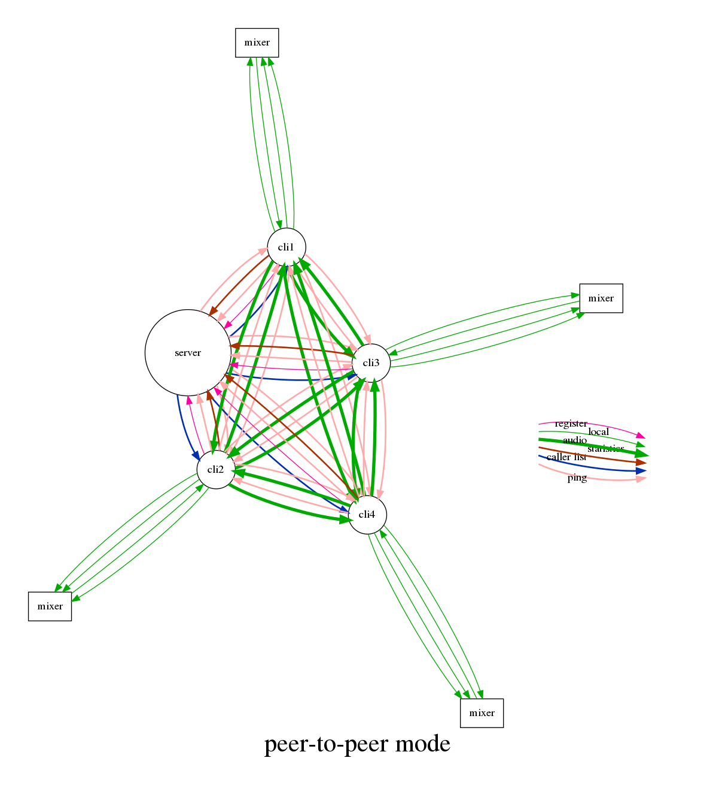
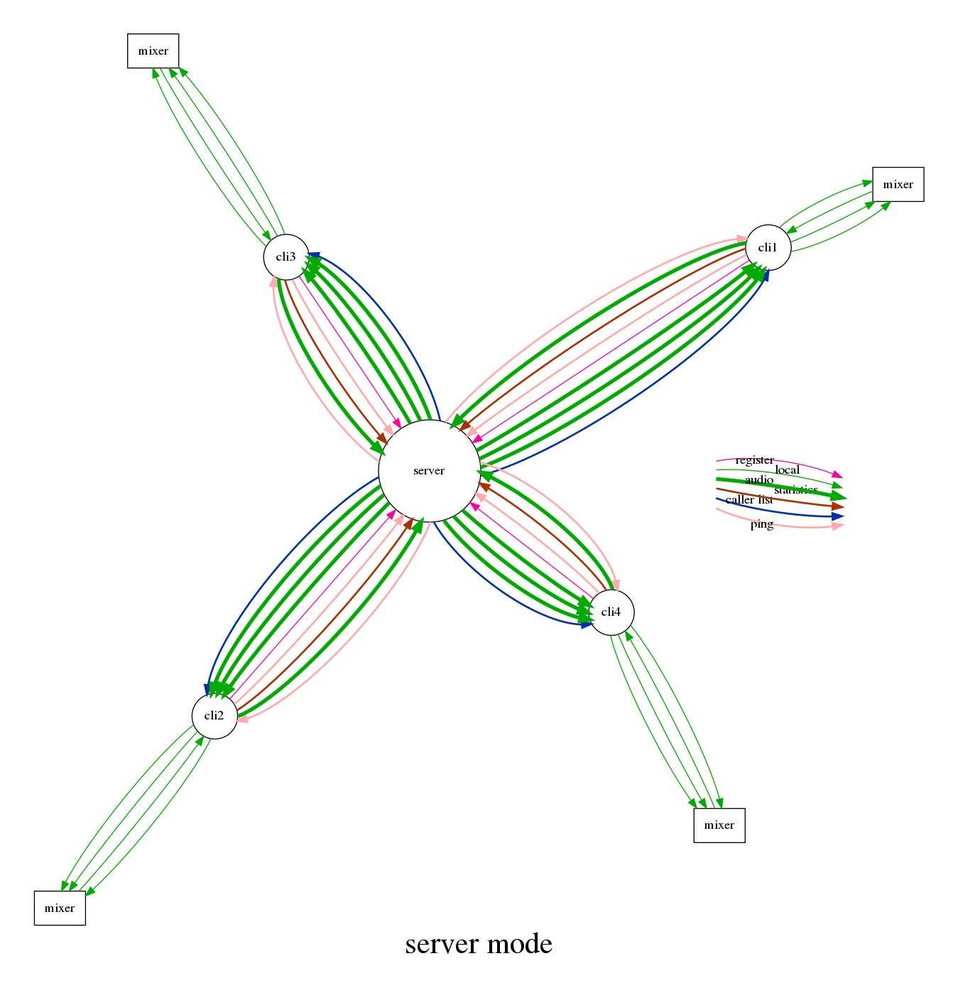
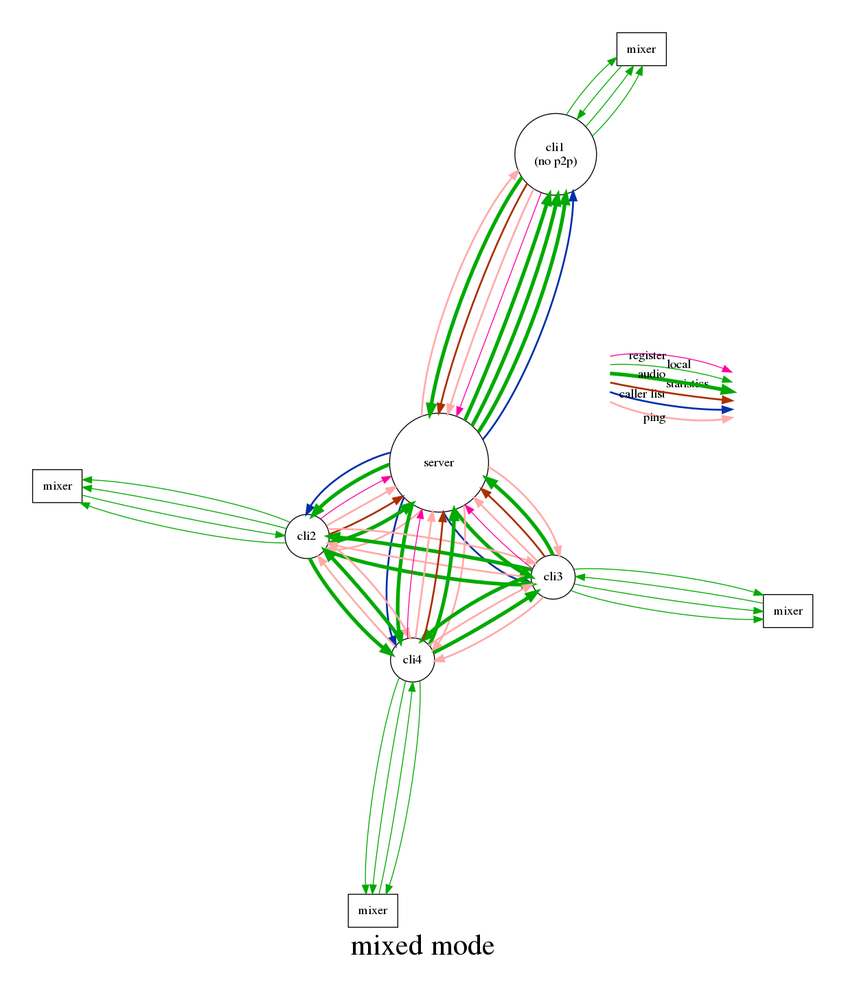
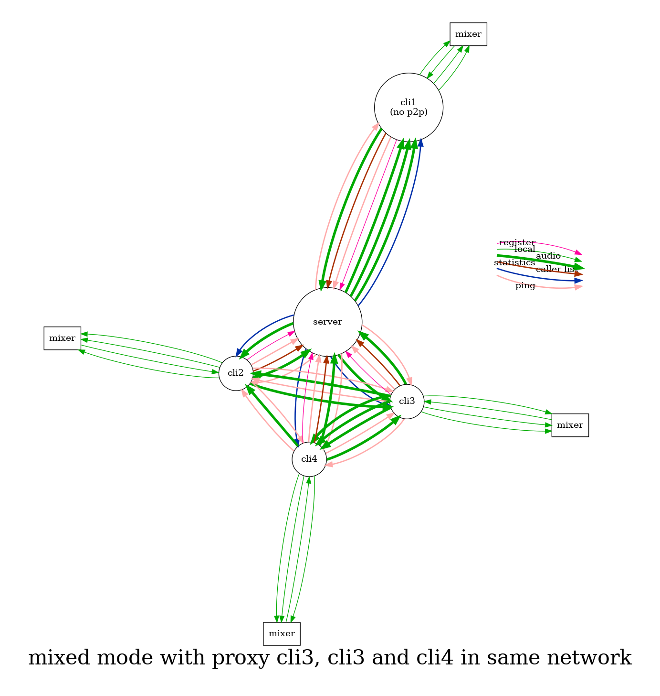

# Client modes

Latency in network audio is caused by the travel time, but even more
by the number of routers to pass. In most cases, the fasted connection
between two computers is the direct path, thus a *peer-to-peer*
connection is typically the fastest way. However, sometimes a
peer-to-peer connection is not possible due to restrictions by the NAT
routers. In these cases, a client-server model is required.

Bandwidth estimates are given below for the outlined sessions with
four clients, one channel per client, 48 kHz sampling rate and 2ms
blocks. Bandwidth usage by control data is neglected. Only bandwidth
to/from the internet is taken into account, no local traffic within
the subnet.

## Peer-to-peer mode

Each peer first registers itself at the server. Then, with the help of
the server, a UDP hole is punched into the NAT router and firewall, to
receive packages from the server and the other peers. The server sends
a list of registered peers to all peers, and the peers can send audio
between themselves.

Bandwidth requirements for each client: 2.7 MBit/s upload, 2.7 MBit/s download

Total traffic: 10.8 MBit/s

## Server mode

Each peer first registers itself at the server. Then, with the help of
the server, a UDP hole is punched into the NAT router and firewall, to
receive packages from the server. The server sends a list of
registered peers to all peers. Each peer sends its audio to the
server. The server sends the audio of all other peers back to the
peer.

Bandwidth requirements for each client: 0.9 MBit/s upload, 2.7 MBit/s download

Total traffic: 14.4 MBit/s

## Mixed mode

Each peer first registers itself at the server, and tells the server
wether it can handle peer-to-peer connections or not.  Then, with the
help of the server, a UDP hole is punched into the NAT router and
firewall, to receive packages from the server. The server sends a list
of registered peers to all peers.

The peers which do not support peer-to-peer mode send their audio to
the server. The peers which support peer-to-peer mode send their audio
to the peers, and if at least one peer exists which does not support
peer-to-peer mode, then also to the server.

The server sends the audio when either the source or the target does
not support peer-to-peer mode.

|        |          |       |
|--------|----------|-------|
| source | receiver | send? |
| p2p    | p2p      | no    |
| p2p    | no p2p   | yes   |
| no p2p | p2p      | yes   |
| no p2p | no p2p   | yes   |

Bandwidth requirements:

cli1: 0.9 MBit/s upload, 2.7 MBit/s download
cli2-4: 2.7 MBit/s upload, 2.7 MBit/s download

Total traffic: 14.4 MBit/s

## Proxy mode

If two or more clients of a session are in the same network or both
exposed directly to the internet, then one of them can be used as an
audio proxy. This proxy will forward all incoming external UDP
messages as well as the data received locally to its proxy
clients. This way the other clients of that session do not need to
send their data to all clients separately, and thus can save upload
bandwidth.

Internally, a device which is receiving directly from a proxy is not
requesting data from the peers or server. The proxy receives a list of
proxy client IP addresses and their stage IDs from the configuration
backend. All incoming data is unpacked and forwarded to the proxy
clients (only if it was not sent by the same clients, to avoid
feedback loops).

Bandwidth requirements:

cli1: 0.9 MBit/s upload, 2.7 MBit/s download
cli2: 1.8 MBit/s upload, 2.7 MBit/s download
cli3: 1.8 MBit/s upload, 1.8 MBit/s download
cli4: 2.7 MBit/s upload, 0 MBit/s download

Total traffic: 10.8 MBit/s

Proxy mode is introduced with version 0.6.150.
