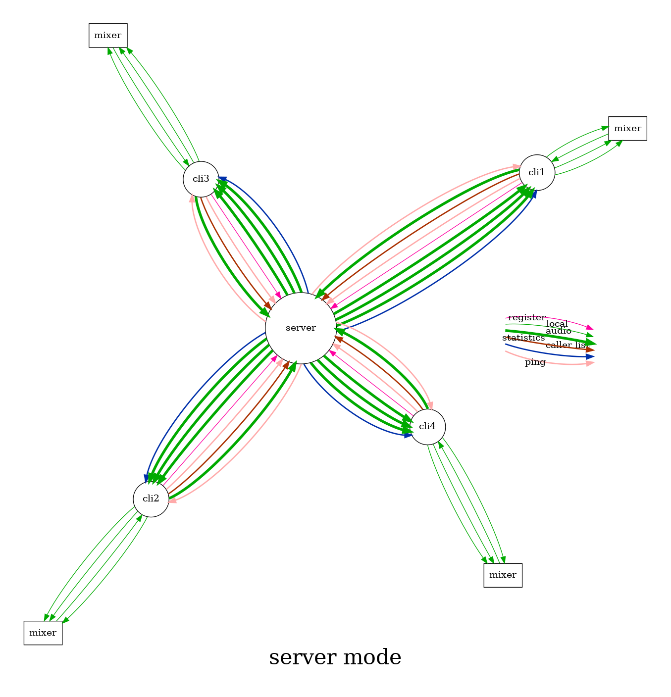
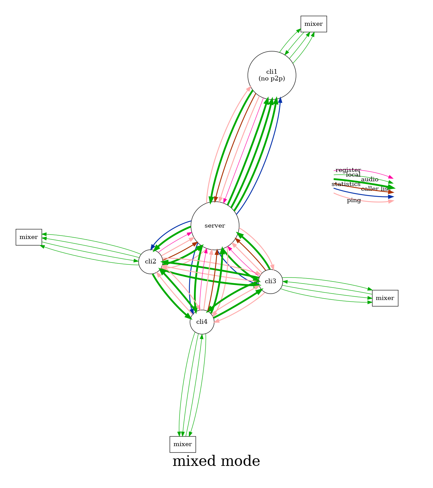

# Client modes

Latency in network audio is caused by the travel time, but even more
by the number of routers to pass. In most cases, the fasted connection
between two computers is the direct path, thus a *peer-to-peer*
connection is typically the fastest way. However, sometimes a
peer-to-peer connection is not possible due to restrictions by the NAT
routers. In these cases, a client-server model is required.

## Peer-to-peer mode

Each peer first registers itself at the server. Then, with the help of
the server, a UDP hole is punched into the NAT router and firewall, to
receive packages from the server and the other peers. The server sends
a list of registered peers to all peers, and the peers can send audio
between themselves.

## Server mode

Each peer first registers itself at the server. Then, with the help of
the server, a UDP hole is punched into the NAT router and firewall, to
receive packages from the server. The server sends a list of
registered peers to all peers. Each peer sends its audio to the
server. The server sends the audio of all other peers back to the
peer.

## Mixed mode

Each peer first registers itself at the server, and tells the server
wether it can handle peer-to-peer connections or not.  Then, with the
help of the server, a UDP hole is punched into the NAT router and
firewall, to receive packages from the server. The server sends a list
of registered peers to all peers.

The peers which do not support peer-to-peer mode send their audio to
the server. The peers which support peer-to-peer mode send their audio
to the peers, and if at least one peer exists which does not support
peer-to-peer mode, then also to the server.

The server sends the audio when either the source or the target does
not support peer-to-peer mode.

|   |   |   |
|---|---|---|
| source | receiver | send? |
| p2p    | p2p      | no    |
| p2p    | no p2p   | yes   |
| no p2p | p2p      | yes   |
| no p2p | no p2p   | yes   |

